# 📖 TypeScript 101
## Index
- [TypeScript의 특징들](#typescript의-주요-특징들)
- [TypeScript 개발환경 설정](#typescript-개발환경-설정)
- [Type Interface, Type Annotations 타입 추론 및 명시](#type-interface)
- [열거형(Enum)과 리터럴 타입](#열거형과-리터럴-타입)
- [Any](#any)
- [Union Type](#union-type)
- [Type Aliases](#type-aliases)
- [Type Guards](#type-guards)
- [함수의 타이핑](#함수의-타이핑)
- [Class and Object](#class-and-object)
- [Errors](#errors)


# TypeScript의 주요 특징들

Created: Jan 10, 2021 4:02 PM 
👀 [참고한 강의](https://www.youtube.com/watch?v=VJ8rvsw2j5w)


## 타입스크립트의 특징

- 변수 정의 시 변수 값에 데이터 타입 지정 가능
- 코드가 예측 가능하고, 디버깅이 쉽다.

```jsx
// Javascript
function add (a, b) {
	return a + b;
}
console.log( add('3', '5'));
```

```tsx
// TypeScript
function add (a:number , b:number) {
	return a + b;
}
console.log( add('3', '5'));
```

자바스크립트의 경우 a, b가 문자열로 취급되어 아무런 오류 없이 8이 아닌 '35' 결과값을 출력할 것이다. 

타입스크립트는 number로 데이터 타입을 지정해주었기 때문에, 오류를 낼 것이다. 

- 객체 지향적
- 컴파일 타임 오류

컴파일 시에 나타나는 에러. 타입 스크립트는 프로그래밍 언어인 동시에 컴파일러로, 타입 스크립트를 자바스크립트로 바꿔준다.

# TypeScript 개발환경 설정

Created: Jan 10, 2021 4:02 PM

`npm install -g typescript` : 현재 작업 중인 프로젝트와 무관하게 전역으로 컴퓨터 내에 타입 스크립트를 설치.

`tsc -v` 혹시나 설치가 되었나 싶어서 해당 명령어를 실행해보니, 이전에는 맛만 보고 제대로 설치를 안 한 모양이다. 그래서 전역으로 설치해주었다. 

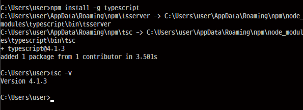

프로그래밍 언어임 동시에 컴파일러. 방금 다운로드 받은 것은 컴파일러!  `tsc` 명령어를 사용해 변환 가능.

`app.ts` 에서 아래와 같이 작성하고, 

```tsx
function logName(name: string) {
	console.log(name);	
}
logName("jack");
```

terminal에서 `tsc app.ts` 를 실행하면, app.js가 생성이 된다. 이때, 매번 컴파일 명령어를 실행하기에는 번거롭기 때문에, `tsc —w app.ts` 로 변경 사항을 실시간으로 업데이트해 컴파일해주는 `—watch` 속성을 쓸 수 있다. 

logName에 밑줄이 그어지는 오류는 `tsc —init` 명령어를 통해 `tsconfig.json` 파일을 생성해줌으로써 피할 수 있다. Node 환경에서는 JavaScript 명령어를 수행하므로, node app.js를 하면 Jack이라고 터미널 창에 결과가 뜨는 것을 확인할 수 있다.


`Ctrl + Shift + J` 로 index.html에 스크립트를 연결해 브라우저의 콘솔창에서도 확인이 가능하다.


# Type Interface, Type Annotations 타입 추론 및 명시

Created: Jan 10, 2021 4:32 PM

# Type Interface

```jsx
let a = 5;
a = "Hello"; 
// 가능!
```

하지만 TypeScript에서는.. 

```tsx
let a = 5;
a = "Hello"; 
// a에 밑줄이 그어지며 아래와 같은 오류 메세지를 낸다. 
```

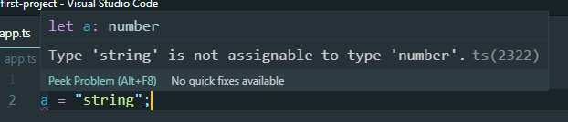

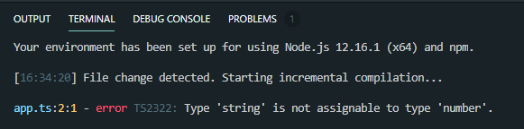

터미널에서도 같은 반응을 보여준다.

즉, 타입스크립트에서는 타입 표기가 없는 경우 코드를 읽고 분석해 타입을 유추할 수 있다. 

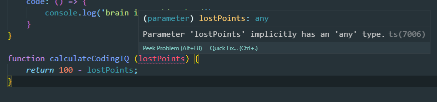

위 같은 함수에서도 마찬가지이다. 우리는, 숫자 100과 연산자 - 를 통해 타입스크립트가 해석한 대로 `number` 형태의 `lostPoints`를 써야 하는 것이다. 

# Type Annotation

변수 선언 시 변수 값의 타입을 명시함으로써, 변수 값의 데이터 타입을 지정


```tsx
let studentID:number = 12345;
let studentName:string = 'Jenny Kim';
let age:number = 21;
let gender:string = 'female';
let subject:string = 'JavaScript';
let courseCompleted:boolean = false;

function getStudentDetails(studentID: number):void {

}
// 함수의 값이 아무 값도 반환하지 않는다면 void를 붙여준다.

```

```tsx
function getStudentDetails(studentID: number): {
    studentID: number;
    studentName: string;
    age: number;
    gender: string;
    subject: string;
    createDate: Date;

} {
    return null;
}
```

TypeScript에서는 타입을 더욱 구체적으로, 명확하게 지정해줄수록 좋다. 반환되는 값을 단순히 object라 지정하는 것 외에도 그 안의 객체 구조를 타입으로 지정할 수 있다. 

하지만, 이렇게 보니 꽤 복잡해보인다. 이를 인터페이스로 해결할 수 있다. 

```tsx
interface Student {
    studentID: number;
    studentName: string;
    age: number;
    gender: string;
    subject: string;
    courseCompleted: Date;
}

function getStudentDetails(studentID: number): Student {
    return {
        studentID: 1234567,
        studentName: 'Mark Jacobs',
        age: 20,
        gender: 'male',
        subject: 'Node JS',
        courseCompleted: true
    }
}
```

[📖 참고 : 타입스크립트 네이밍 컨벤션 문서](https://github.com/microsoft/TypeScript/wiki/Coding-guidelines)

> Use PascalCase for type names.
 Do not use "I" as a prefix for interface names.

인터페이스 타입으로 가지는 값은 인터페이스의 구조를 그 값으로 가지도록 강제된다. 

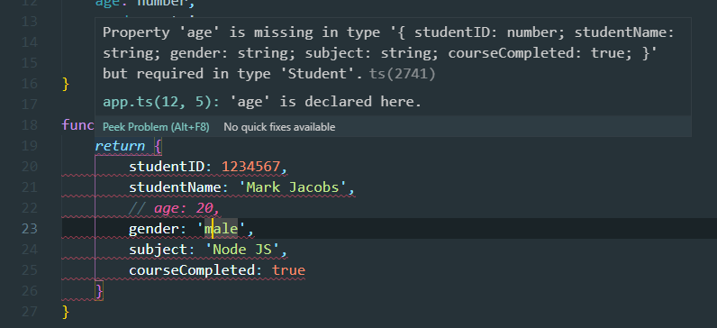

만일 interface에 정의한 객체 구조를 그대로 따르지 않을 경우 오류를 낼 것이다. 이러한 인터페이스를 좀 더 유연하게 사용하기 위해서는 어떻게 해야 할까?

인터페이스 정의할 때 optional 기호인 물음표를 붙일 수 있는데, age 프로퍼티 변수 뒤에 물음표를 붙여보자.

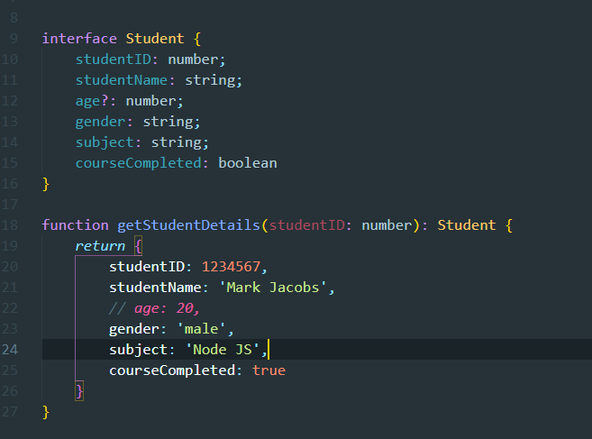

이제 오류를 출력하지 않는다. 이를 `선택적 프로퍼티`라고 한다.

이번에 우리는 student 정보를 저장하는 함수를 만들 것이다. 아무것도 반환하지 않으므로 해당 함수의 결과값은 `:void` 를 갖고, 해당 함수의 객체 구조는 아까 만들어둔 interface를 따를 것이다.

```tsx
function saveStudentDetail (student: Student):void {
}

saveStudentDetail({
    studentID: 11111,
    studentName: 'Janet Jackson',
    age: 30,
    gender: 'female',
    subject: 'Mongo DB',
    courseCompleted: false
})
```

해당 함수를 부르고, 인자로 새로운 정보값을 주도록 하자. 위 함수의 내용을 미리 선언해주고, 변수의 이름을 인자로 넣어주어도 오류 없이 잘 컴파일이 된다. 

```tsx
let student1 = {
    studentID: 11111,
    studentName: 'Janet Jackson',
    age: 30,
    gender: 'female',
    subject: 'Mongo DB',
    courseCompleted: false
}

saveStudentDetail(student1);
```

# 메소드도 인터페이스 내에 정의 가능하다.

메소드는 객체 내에서 선언된 함수라고 생각하면 되는데, 메소드를 인터페이스 내에 정의하는 방법에는 두 가지가 있다. 

```tsx
interface Student {
    studentID: number;
    studentName: string;
    age?: number;
    gender: string;
    subject: string;
    courseCompleted: boolean;
    addComment (comment: string): string; // 1
    addComment: (comment:string) => string; // 2
}
```

두 방법 모두 같은 결과를 갖는다. 

# Read only 속성

읽기 전용 프로퍼티로, 객체 생성 시 할당된 프로퍼티의 값을 바꿀 수 없다. 

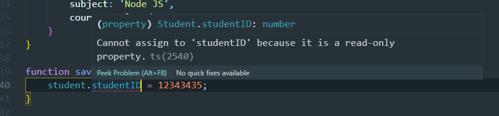

읽기 전용 속성에 값을 부여하려고 했더니, 오류가 난다. 

마지막으로..

인터페이스는 타입 스크립트 → 자바스크립트로 컴파일될 때 지워진다. 

app.js에서 인터페이스를 확인할 수 없는 이유.

# 열거형과 리터럴 타입

Created: Jan 10, 2021 5:50 PM

앞서 정의한, gender property 중 우리는 female과 male로 두 가지만 제한해서 부여하고자 할 때가 있을 것이다. 단순히 String으로만 제한하는 대신, 크게 두 가지 방법을 사용할 수 있다.

# 열거형 (Enum)

'연관된 아이템들을 함께 묶어서 표현할 수 있는 수단'이라고 생각해보자. 

```tsx
enum GenderType {
    Male,
    Female
}
// ..

interface Student {
    readonly studentID: number;
    studentName: string;
    age?: number;
    gender: GenderType; // string 대신 미리 선언한 Enum으로 대체
    subject: string;
    courseCompleted: boolean;
    // addComment (comment: string): string;
    addComment?: (comment:string) => string;
}
```

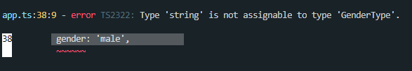

```tsx
function getStudentDetails(studentID: number): Student {
    return {
        studentID: 1234567,
        studentName: 'Mark Jacobs',
        // age: 20,
        gender: GenderType.Male, // string -> GenderType.Male
        subject: 'Node JS',
        courseCompleted: true
    }
}
```

이때 컴파일 시 사라지는 Interface와 달리, Enum은 아래처럼 JavaScript 파일에 남게 되는데, 실제 런타임 시 구현되는 객체임을 알 수 있다. 

```jsx
(function (GenderType) {
    GenderType[GenderType["Male"] = 0] = "Male";
    GenderType[GenderType["Female"] = 1] = "Female";
})(GenderType || (GenderType = {}));
```

위 코드를 보면 정의된 순서에 따라 Gender 값인 Male에 0, Female에 1이 부여되었는데, 이때 GenderNeutral이라는 값을 선언해주고, 컴파일 하면 새롭게 부여된 속성에는 이후의 숫자인 2가 부여가 된다. 

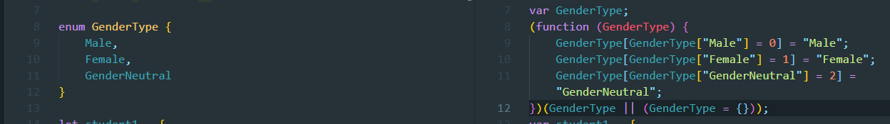
 

그런데 이렇게 부여되는 숫자 대신 문자형으로 쓰고 싶다면 어떨까 ? TS는 문자형 Enum을 제공한다. 

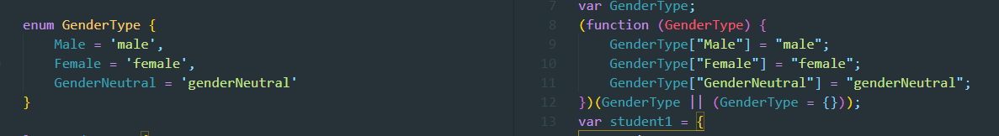

# 리터럴 타입

```jsx
interface Student {
    readonly studentID: number;
    studentName: string;
    age?: number;
    gender: 'male' | 'female' | 'genderNeutral';
    subject: string;
    courseCompleted: boolean;
    // addComment (comment: string): string;
    addComment?: (comment:string) => string;
}
```

GenderType이라는 enum을 만든 것과 다르게 훨씬 더 간단하게 파이프라인(`|`) 으로 구분해 사용 가능하다. 

실제로 사용할 때는,

```jsx
function getStudentDetails(studentID: number): Student {
    return {
        studentID: 1234567,
        studentName: 'Mark Jacobs',
        // age: 20,
        gender: 'male',
        subject: 'Node JS',
        courseCompleted: true
    }
}
```

열거한 enum 중 하나를 선택해 사용하면 된다.

# TypeScript (Any, Union Type, Type Aliases, Type Guards)

Created: Jan 10, 2021 6:34 PM

# Any

```tsx
let someValue: any; // 어떤 타입이든 모두 가능하다

let someValue: any;

someValue = {};
someValue = 5;
someValue = 'wow';
// 모두 에러 없이 컴파일된다. 
```

하지만, TypeScript는 타입에 관한 더 많은 정보를 명시할수록 더 좋다. 

효과적인 코드의 유지 보수가 가능하다. 

any 은 최대한 피하는 것이 좋다. 그러나 작업 중 타입 명시가 어려운 경우, 예를 들어 동적으로 타입을 가져오는 경우, 이런 경우에는 아주 제한적으로 any를 사용한다. 

# Union Type

제한된 타입들을 동시에 지정하고자 하면, `Union Type`

```tsx
let someValue: number | string;
```

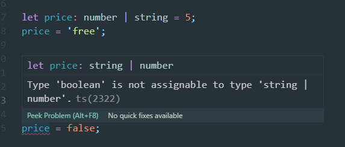

# Type Aliases

같은 코드를 반복하는 것보다 코드를 타입으로 지정하고 재활용. 

```tsx
let orderID: number | string;
let totalCost: number;

const calculateTotalCost = (price: number | string, qty: number):void => {

};

const findOrderID = (customer: {
    customerId: number | string,
    name: string
},
    productId: number | string
): number | string => {
     return orderID;
 }
```

반복되는 코드가 너무 많아서 눈이 아플 지경..👀

```tsx
type StrOrNum = number | string;
```

위 Type Aliases를 추가해주고, 코드를 가볍게 해보자!

```tsx
type StrOrNum = number | string;
let orderID: StrOrNum;
let totalCost: number;

const calculateTotalCost = (price: StrOrNum, qty: number):void => {

};

const findOrderID = (customer: {
    customerId: StrOrNum,
    name: string
},
    productId: StrOrNum
): StrOrNum => {
     return orderID;
 }
```

# Type Guards

```tsx
type StringOrNum = string | number;
let itemPrice: number;

const setItemPrice = (price: StringOrNum):void => {
    itemPrice = price;
};

setItemPrice(50);
```

number로 지정한 itemPrice에 String이 올 가능성이 있는 StringOrNum 타입을 우리는 지정해주고 있다. 따라서, 이를 막아줄 필요성이 있다. 

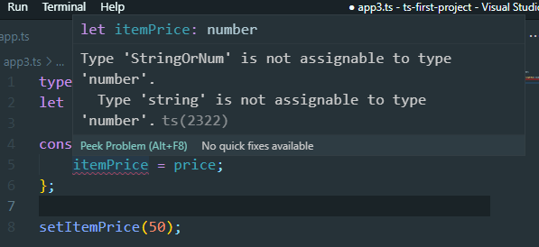

이때에는 Typeof 연산자와 조건문을 사용해 해결한다. 

```tsx
type StringOrNum = string | number;
let itemPrice: number;

const setItemPrice = (price: StringOrNum):void => {
    if (typeof price === 'string') {
        itemPrice = 0;   
    } else {
        itemPrice = price;       
    }
};

setItemPrice(50);
```

이런 방식을 TypeGuard라고 부른다. 타입 가드를 쓰는 방법은 typeof 연산자 외에도 여러 방법이 있다. 공식 문서를 참고할 것.

# TypeScript 함수의 타이핑, 선택적 매개변수, 기본 매개변수, 화살표 함수

Created: Jan 10, 2021 7:17 PM

# 함수의 타이핑

## 함수의 반환(Return) 타입

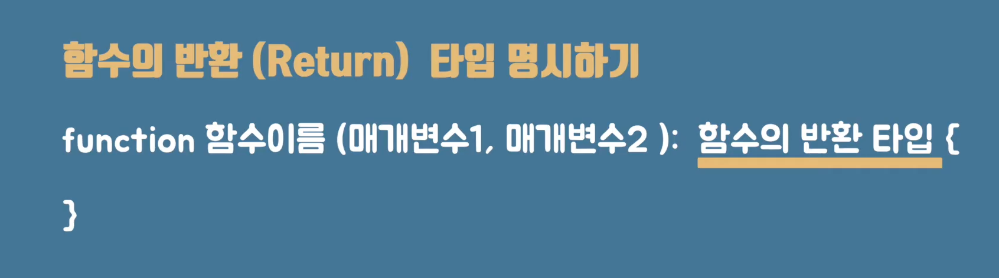
👀 [Captured Image from This Youtube Channel](https://www.youtube.com/watch?v=VJ8rvsw2j5w)


만일 반환하는 값이 배열이라면 `:string[]` 이렇게 표시할 수 있다.

## 함수의 매개변수 (Parameter)

```tsx
function sendGreeting (message:string, userName:string):void {
    console.log (`${message}, ${userName}`);
}

sendGreeting('Hello', 'Hannah');
```

TS에서는 함수에 정의된 모든 매개변수가 함수에 필요하다고 가정한다. 

따라서 위의 경우, userName을 정의했지만, 함수를 call 하는 과정에서 'Hannah'라는 두 번째 매개변수를 삭제한다면, 에러가 날 것이다. 

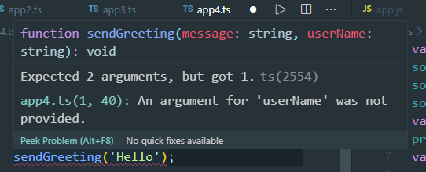

단, 이때 유연하게 함수를 쓰고자 한다면

```tsx
function sendGreeting (message:string, userName?:string):void {
    console.log (`${message}, ${userName}`);
}

sendGreeting('Hello');
```

optional parameter에 대해서 물음표를 붙여 선택적 매개변수 활용으로 만들어준다. 


만일 이때, 전달하는 매개변수가 여러 개이고, 선택적 매개변수가 여러 개인 경우 "선택적 매개변수들은 필수 매개변수 뒤에 위치"해야 한다. 

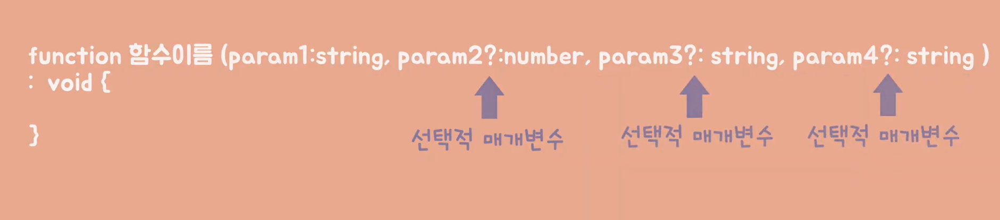
👀 [Captured Image from This Youtube Channel](https://www.youtube.com/watch?v=VJ8rvsw2j5w)

TS 규칙 상, 선택적 매개변수 뒤에 오는 매개변수들이 모두 선택적 매개변수가 되므로, 필수 매개변수를 먼저 써주어야 한다. 

이때, 위 터미널 결과에서는 userName을 써주지 않아 undefined가 출력이 되었는데, 만일, 아무런 매개변수를 받지 않았을 때는 고정된 값을 갖고 싶을 때 기본 매개변수(default parameter)를 쓸 수 있다. 

```tsx
function sendGreeting (message:string, userName?:string = 'this is default'):void {
    console.log (`${message}, ${userName}`);
}

sendGreeting('Hello');
```

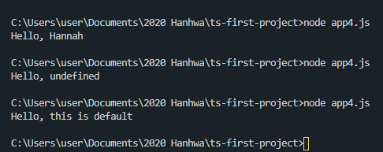

그런데 이상한 건, optional parameter에 대해서 물음표를 썼을 때, 컴파일은 잘 되지만, 아래처럼 Parameter는 물음표를 가지지 못한다고 나온다. 

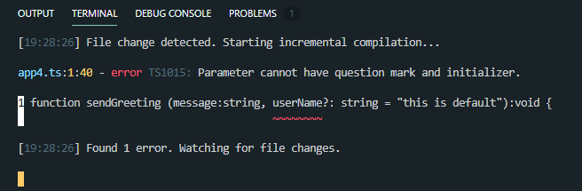

default parameter를 쓰기 시작하면 더 이상 선택적 매개변수를 사용할 이유가 없으므로, 코드를 아래처럼 개선할 수 있다.

```tsx
function sendGreeting (message:string, userName = "this is default"):void {
    console.log (`${message}, ${userName}`);
}

sendGreeting('Hello');
```

매개변수에 주어지는 default 값을 기준으로 TS는 타입 추론을 통해 개발자가 타입을 명시하지 않아도 되게끔 한다. 

```tsx
function sendGreeting (message = "Hello", userName = "this is default"):void {
    console.log (`${message}, ${userName}`);
}

sendGreeting(); 
sendGreeting("Good Morning"); 
sendGreeting("Good Night", "Hannah");
```

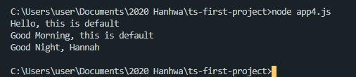

마지막으로 화살표 함수를 써서 더욱 가볍게 바꿔보자. statement 코드 부분이 한 줄이라면 괄호도 생략이 가능하다. 

```tsx
const sendGreeting = (message = "Hello", userName = "this is default"):void => console.log (`${message}, ${userName}`);

sendGreeting(); 
sendGreeting("Good Morning"); 
sendGreeting("Good Night", "Hannah");
```


# Class and Object

Created: Jan 10, 2021 7:33 PM


객체들은 클라스를 통해서 만들어질 수 있고, 클라스는 객체의 뼈대, 설계도, 생산틀이라고 볼 수 있다. 

설계도를 통해 인스턴스를 만들자.

```tsx
class Employee {
    fullName: string;
    age: number;
    jobTitle: string;
    hourlyRate: number;
    workingHoursPerWeek: number;
    
    printEmployeeDetails = ():void => {
        console.log(`${this.fullName}의 직업은 ${this.jobTitle}이고, 일주일 수입은 ${this.hourlyRate * this.workingHoursPerWeek} 달러이다.`);
    }
}
// printEmployeeDetails('Hannah', 'Developer', 9, 40);
```

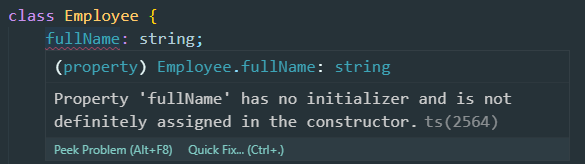

클라스 내에서 this 키워드를 통해 접근 가능하므로, 함수에 적어둔 매개변수를 다 지워줄 수 있다.
따라서 결과적으로 클라스 속에서 정의된 함수들은 상대적으로 적은 매개변수를 가진다.  
클라스 내에 정의된 변수는 '프라퍼티', 함수는 '메서드'라고 부른다.

```tsx
class Employee {
    fullName: string;
    age: number;
    jobTitle: string;
    hourlyRate: number;
    workingHoursPerWeek: number;
    
    printEmployeeDetails = ():void => {
        console.log(`${this.fullName}의 직업은 ${this.jobTitle}이고, 일주일 수입은 ${this.hourlyRate * this.workingHoursPerWeek} 달러이다.`);
    }
}

let employee1 = new Employee();
employee1.printEmployeeDetails();
```

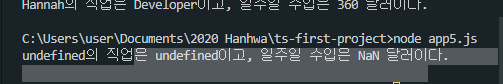

```tsx
let employee1 = new Employee();
employee1.fullName = '하나';
employee1.age = 28;
employee1.jobTitle = 'Junior Developer';
employee1.hourlyRate = 40;
employee1.workingHoursPerWeek = 35;
employee1.printEmployeeDetails();
```

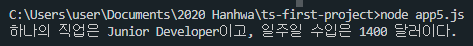

<hr/>
# Errors

> TS2564 Error
    typeScript 2.7.2 included a strict class checking where all properties should be declared in constructor. So to work around that, just add a bang sign (`!`) like: `name!:string;`

    또는 compiler option에서 "`strictPropertyInitialization: false`"

- [⚠ TS2564 Error : Property '~' has no initializer and is not definitely assigned in the constructor](https://uiyoji-journal.tistory.com/44) (updated 2021-01-11)
