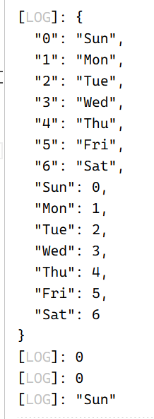
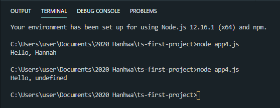

# 📖 TypeScript 101

## Index

- [TypeScript의 특징들](#typescript의-주요-특징들)
- [TypeScript 개발환경 설정](#typescript-개발환경-설정)
- [Type inference, Type Annotations 타입 추론 및 명시](#type-inference)
- [Type Assertions](#type-assertions)
- [열거형(Enum)과 리터럴 타입](#열거형과-리터럴-타입)
- [Any](#any)
- [Unknown](#unknown)
- [Union Type](#union-type)
- [Type Aliases](#type-aliases)
- [Interface](#interface)
- [Type Narrowing](#type-narrowing)
- [Type Guards](#type-guards)
- [Functions](#functions)
- [Overload](#overload)
- [This](#this)
- [Class and Object](#class-and-object)
- [Null과 undefined](#null과-undefined)
- [Void](#void)
- [Never](#never)
- [Intersection](#intersection)
- [Errors](#errors)
- [Reference](#reference)

# TypeScript의 주요 특징들
Created: Jan 10, 2021 4:02 PM

## 타입스크립트의 특징

- 변수 정의 시 변수 값에 데이터 타입 지정 가능
- 코드가 예측 가능하고, 디버깅이 쉽다.

```jsx
// Javascript
function add(a, b) {
  return a + b;
}
console.log(add("3", "5"));
```

```tsx
// TypeScript
function add(a: number, b: number) {
  return a + b;
}
console.log(add("3", "5"));
```

자바스크립트의 경우 a, b가 문자열로 취급되어 아무런 오류 없이 8이 아닌 '35' 결과값을 출력할 것이다.

타입스크립트는 number로 데이터 타입을 지정해주었기 때문에, 오류를 낼 것이다.

- 객체 지향적
- 컴파일 타임 오류

컴파일 시에 나타나는 에러. 타입 스크립트는 프로그래밍 언어인 동시에 컴파일러로, 타입 스크립트를 자바스크립트로 바꿔준다.

# TypeScript 개발환경 설정

Created: Jan 10, 2021 4:02 PM

`npm install -g typescript` : 현재 작업 중인 프로젝트와 무관하게 전역으로 컴퓨터 내에 타입 스크립트를 설치.

`tsc -v` 혹시나 설치가 되었나 싶어서 해당 명령어를 실행해보니, 이전에는 맛만 보고 제대로 설치를 안 한 모양이다. 그래서 전역으로 설치해주었다.


프로그래밍 언어임 동시에 컴파일러. 방금 다운로드 받은 것은 컴파일러! `tsc` 명령어를 사용해 변환 가능.

`app.ts` 에서 아래와 같이 작성하고,

```tsx
function logName(name: string) {
  console.log(name);
}
logName("jack");
```

terminal에서 `tsc app.ts` 를 실행하면, app.js가 생성이 된다. 이때, 매번 컴파일 명령어를 실행하기에는 번거롭기 때문에, `tsc —w app.ts` 로 변경 사항을 실시간으로 업데이트해 컴파일해주는 `—watch` 속성을 쓸 수 있다.

logName에 밑줄이 그어지는 오류는 `tsc —init` 명령어를 통해 `tsconfig.json` 파일을 생성해줌으로써 피할 수 있다. Node 환경에서는 JavaScript 명령어를 수행하므로, node app.js를 하면 Jack이라고 터미널 창에 결과가 뜨는 것을 확인할 수 있다.


`Ctrl + Shift + J` 로 index.html에 스크립트를 연결해 브라우저의 콘솔창에서도 확인이 가능하다.

# Type Inference, Type Annotations 타입 추론 및 명시

Created: Jan 10, 2021 4:32 PM

# Type Inference (타입 추론)

```jsx
let a = 5;
a = "Hello";
// 가능!
```

하지만 TypeScript에서는..

```tsx
let a = 5;
a = "Hello";
// a에 밑줄이 그어지며 아래와 같은 오류 메세지를 낸다.
```


터미널에서도 같은 반응을 보여준다.

즉, 타입스크립트에서는 타입 표기가 없는 경우 코드를 읽고 분석해 타입을 유추할 수 있다.

타입 스크립트가 타입을 추론하는 경우는

- 초기화된 변수
- 기본값 설정된 매개변수
- 반환값 있는 함수


위 같은 함수에서도 마찬가지이다. 우리는, 숫자 100과 연산자 - 를 통해 타입스크립트가 해석한 대로 `number` 형태의 `lostPoints`를 써야 하는 것이다.

# Type Assertions

타입 단언 : 타입추론이 불가한 수준일 때는 지시를 통해 타입 추론을 하지 않을 수 있다. 즉, 타입스크립트보다 프로그래머가 타입에 대해 더 잘 알고 있을 경우.

```tsx
function example(val: string | number, isNumber: boolean) {
  // logic..
  if (isNumber) {
    val.toFixed(2); // Error TS2339
    // 프로그래머는 isNumber가 true일 경우 val이 number이고, toFixed를 사용할 수 있음을 알지만, 타입 스크립트는 isNumber라는 이름만으로는 추론이 불가한 상황. 즉, val이 문자열인 경우 toFixed를 사용할 수 없다고 카운트하므로, 컴파일 시 에러를 내는 것.
  }
  // 이를 두 가지 방식으로 단언해보자.
}

function example(val: string | number, isNumber: boolean) {
  // logic..
  if (isNumber) {
    (val as number).toFixed(2);
    // or

    // (<number>val).toFixed(2);
  }
}
```

# Type Annotation

변수 선언 시 변수 값의 타입을 명시함으로써, 변수 값의 데이터 타입을 지정

## Boolean

```tsx
let isBoolean: boolean;
let isDone: boolean = false;
```

## Number

모든 부동 소수점 값 사용 가능. 2진수나 8진수 리터럴 지원 (ES6)

```tsx
let num: number;
let integer: number = 6;
let float: number = 3.14;
let hex: number = 0xf00d; // 61453
let binary: number = 0b1010; // 10
let octal: number = 0o744; // 484
let infinity: number = Infinity;
let nan: number = NaN;
```

## String

'(작은 따옴표), "(큰따옴표), `(ES6 템플릿 문자열) 지원

```tsx
let str: string;
let red: string = "Red";
let green: string = "Green";
let myColor: string = `My Color is ${green}`;
let yourColor: string = "Your Color is " + red;
```

## Array

```tsx
// Case 1 : An array only contains string type
let fruts: string[] = ['Apple', 'Banana', 'Orange'];
let gwail: Array<string> = ['사과', '바나나', '오렌지'];

// Case 2 : An array only contains number type
let oneToFive: number[] = [1, 2, 3, 4, 5];
let oneToDaseot: Array<number> = [1, 2, 3, 4, 5];

// Case 3 : An array contains multiple types
let UnionArr: (string | number)[] = [1, 'apple', 2, 'banana'];
let UnionArray: Array<string | number> = ['사과', 1, '바나나', 2];

// Case 4 : An array can not be clearly defined yet
let someArr: any[] = [0, undefined, null, false, 'str', {}, []];

// Case 5 : An array uses Interface or Custom Type
interfacee User {
    name: string,
    age: number,
    isValid: boolean
}
let userArr: User[] = [
    {
        name: 'Hannah',
        age: 28,
        isValid: true
    },
    {
        name: 'Hanseo',
        age: 10,
        isValid: false
    },
    {
        name: 'Rose',
        age: 62,
        isValid: true
    }
]
// Case 6 : readonly array
let arrA: readonly number[] = [1, 2, 3, 4, 5];
let arrB: ReadOnlyArray<number> = [2, 3, 45, 5];

arrA[0] = 23; // TS2542 Error
arrA.push(123); // TS2339 Error

// Case 7 : Tuple, which is similar to an Array but its length is fixed
let tuple: [string, number];
tuple = ["a", 0];
tuple = ["b", 10, 20]; // TS2322 Error
tuple = [100, "c"]; // TS2322 Error

// 👍 Plus Tip
// Variables
let userId: number = 1234;
let userName: string = 'Hannah';
let isValid: boolean = true;

// Tuple
let user: [number, string, boolean] = [1234, 'Hannah', true];
console.log(user[0]); // 1234

// 👍 Plus Tip
let users: [number, string, boolean][];
// or let users: Array<[number, string, boolean]>;

users = [[0123, 'woogie', false],[1234, 'paul', true],[2345, 'semi', true]]

// tuple can has value instead of type for declaration
let thisIsTuple: [3, string];
thisIsTuple = [10, 'hello'];
thisisTuple = ['number', 30]; // TS2322 Error Type 'number' is not assignable to type '3' or Type '30' is not assignable to type string

// we can force JS to keep this rule when we assign it into tuple but for the cases like .push() or .splcie(), we can't watch the rules

let poorTuple: [string, string];
poorTuple = [100, 200]; // Error
poorTuple = ['My Name is', 'Semi']; // It's fine
poorTuple.push(3);
poorTuple.push(true); // Error TS2345
console.log(poorTuple); // ['My Name is', 'Semi', 3];

// readonly Tuple
let aTuple: readonly [string, number] = ['Hello', 2021];
aTuple[0] = 'goodBye 2020'; // Error TS2540
```

```tsx
let studentID: number = 12345;
let studentName: string = "Jenny Kim";
let age: number = 21;
let gender: string = "female";
let subject: string = "JavaScript";
let courseCompleted: boolean = false;

function getStudentDetails(studentID: number): void {}
// 함수의 값이 아무 값도 반환하지 않는다면 void를 붙여준다.
```

```tsx
function getStudentDetails(
  studentID: number
): {
  studentID: number;
  studentName: string;
  age: number;
  gender: string;
  subject: string;
  createDate: Date;
} {
  return null;
}
```

TypeScript에서는 타입을 더욱 구체적으로, 명확하게 지정해줄수록 좋다. 반환되는 값을 단순히 object라 지정하는 것 외에도 그 안의 객체 구조를 타입으로 지정할 수 있다.

하지만, 이렇게 보니 꽤 복잡해보인다. 이를 인터페이스로 해결할 수 있다.

```tsx
interface Student {
  studentID: number;
  studentName: string;
  age: number;
  gender: string;
  subject: string;
  courseCompleted: Date;
}

function getStudentDetails(studentID: number): Student {
  return {
    studentID: 1234567,
    studentName: "Mark Jacobs",
    age: 20,
    gender: "male",
    subject: "Node JS",
    courseCompleted: true,
  };
}
```

[📖 참고 : 타입스크립트 네이밍 컨벤션 문서](https://github.com/microsoft/TypeScript/wiki/Coding-guidelines)

> Use PascalCase for type names.
> Do not use "I" as a prefix for interface names.

인터페이스 타입으로 가지는 값은 인터페이스의 구조를 그 값으로 가지도록 강제된다.


만일 interface에 정의한 객체 구조를 그대로 따르지 않을 경우 오류를 낼 것이다. 이러한 인터페이스를 좀 더 유연하게 사용하기 위해서는 어떻게 해야 할까?

인터페이스 정의할 때 optional 기호인 물음표를 붙일 수 있는데, age 프로퍼티 변수 뒤에 물음표를 붙여보자.


이제 오류를 출력하지 않는다. 이를 `선택적 프로퍼티`라고 한다.

이번에 우리는 student 정보를 저장하는 함수를 만들 것이다. 아무것도 반환하지 않으므로 해당 함수의 결과값은 `:void` 를 갖고, 해당 함수의 객체 구조는 아까 만들어둔 interface를 따를 것이다.

```tsx
function saveStudentDetail(student: Student): void {}

saveStudentDetail({
  studentID: 11111,
  studentName: "Janet Jackson",
  age: 30,
  gender: "female",
  subject: "Mongo DB",
  courseCompleted: false,
});
```

해당 함수를 부르고, 인자로 새로운 정보값을 주도록 하자. 위 함수의 내용을 미리 선언해주고, 변수의 이름을 인자로 넣어주어도 오류 없이 잘 컴파일이 된다.

```tsx
let student1 = {
  studentID: 11111,
  studentName: "Janet Jackson",
  age: 30,
  gender: "female",
  subject: "Mongo DB",
  courseCompleted: false,
};

saveStudentDetail(student1);
```

# 메소드도 인터페이스 내에 정의 가능하다.

메소드는 객체 내에서 선언된 함수라고 생각하면 되는데, 메소드를 인터페이스 내에 정의하는 방법에는 두 가지가 있다.

```tsx
interface Student {
  studentID: number;
  studentName: string;
  age?: number;
  gender: string;
  subject: string;
  courseCompleted: boolean;
  addComment(comment: string): string; // 1
  addComment: (comment: string) => string; // 2
}
```

두 방법 모두 같은 결과를 갖는다.

# Read only 속성

읽기 전용 프로퍼티로, 객체 생성 시 할당된 프로퍼티의 값을 바꿀 수 없다.


읽기 전용 속성에 값을 부여하려고 했더니, 오류가 난다.

마지막으로..

인터페이스는 타입 스크립트 → 자바스크립트로 컴파일될 때 지워진다.

app.js에서 인터페이스를 확인할 수 없는 이유.

# 열거형과 리터럴 타입

Created: Jan 10, 2021 5:50 PM

앞서 정의한, gender property 중 우리는 female과 male로 두 가지만 제한해서 부여하고자 할 때가 있을 것이다. 단순히 String으로만 제한하는 대신, 크게 두 가지 방법을 사용할 수 있다.

# 열거형 (Enum)

'연관된 아이템들을 함께 묶어서 표현할 수 있는 수단'이라고 생각해보자. Enum은 숫자 혹은 문자열 값 집합에 이름을 부여할 수 있는 타입. 값의 종류가 일정한 범위로 제한되어 있을 경우 사용.

```tsx

// example 2
enum Week {
    Sun,
    Mon,
    Tue,
    Wed,
    Thu,
    Fri,
    Sat
}
console.log(Week.Mon); // 1

// we can adjust the number on purpose.
enum Week2 {
    Sun
    Mon = 17
    Tue,
    Wed,
    Thu,
    Fri,
    Sat
}
console.log(Week2.Tue); // 18

// Enum supports 'Reverse Mapping'
console.log(Week);
console.log(Week.Sun); // 0
console.log(Week['Sun']); // 0
console.log(Week[0]); // 'Sun'

```



```tsx
// ..
enum GenderType {
  Male,
  Female,
}

interface Student {
  readonly studentID: number;
  studentName: string;
  age?: number;
  gender: GenderType; // string 대신 미리 선언한 Enum으로 대체
  subject: string;
  courseCompleted: boolean;
  // addComment (comment: string): string;
  addComment?: (comment: string) => string;
}
```


```tsx
function getStudentDetails(studentID: number): Student {
  return {
    studentID: 1234567,
    studentName: "Mark Jacobs",
    // age: 20,
    gender: GenderType.Male, // string -> GenderType.Male
    subject: "Node JS",
    courseCompleted: true,
  };
}
```

이때 컴파일 시 사라지는 Interface와 달리, Enum은 아래처럼 JavaScript 파일에 남게 되는데, 실제 런타임 시 구현되는 객체임을 알 수 있다.

```jsx
(function (GenderType) {
  GenderType[(GenderType["Male"] = 0)] = "Male";
  GenderType[(GenderType["Female"] = 1)] = "Female";
})(GenderType || (GenderType = {}));
```

위 코드를 보면 정의된 순서에 따라 Gender 값인 Male에 0, Female에 1이 부여되었는데, 이때 GenderNeutral이라는 값을 선언해주고, 컴파일 하면 새롭게 부여된 속성에는 이후의 숫자인 2가 부여가 된다.


그런데 이렇게 부여되는 숫자 대신 문자형으로 쓰고 싶다면 어떨까 ? TS는 문자형 Enum을 제공한다. 하지만 이 경우에는 'Reverse Mapping'은 제공하지 않으며 개별적으로 초기화해야 한다.


# 리터럴 타입

```jsx
interface Student {
    readonly studentID: number;
    studentName: string;
    age?: number;
    gender: 'male' | 'female' | 'genderNeutral';
    subject: string;
    courseCompleted: boolean;
    // addComment (comment: string): string;
    addComment?: (comment:string) => string;
}
```

GenderType이라는 enum을 만든 것과 다르게 훨씬 더 간단하게 파이프라인(`|`) 으로 구분해 사용 가능하다.

실제로 사용할 때는,

```jsx
function getStudentDetails(studentID: number): Student {
  return {
    studentID: 1234567,
    studentName: "Mark Jacobs",
    // age: 20,
    gender: "male",
    subject: "Node JS",
    courseCompleted: true,
  };
}
```

열거한 enum 중 하나를 선택해 사용하면 된다.

# Any, Union Type, Type Aliases, Type Guards

Created: Jan 10, 2021 6:34 PM

# Any

```tsx
let someValue: any; // 어떤 타입이든 모두 가능하다.

let someValue: any;

someValue = {};
someValue = 5;
someValue = "wow";
someValue = null;

let someList: any[] = [{}, 5, "wowow", null, true]; // 다양한 값 포함하는 배열

// 모두 에러 없이 컴파일된다.
```

하지만, TypeScript는 타입에 관한 더 많은 정보를 명시할수록 더 좋다.

효과적인 코드의 유지 보수가 가능하다.

any 은 최대한 피하는 것이 좋다. 타입 스크립트의 의도와 어긋나기 때문. 그러나 외부 자원을 활용해 작업 시 타입을 단언하기 어려울 때 제한적으로 Any를 써줄 수 있다.

만일 더욱 Strict하게 쓰고 싶다면, 컴파일 옵션 "noImplicitAny: true"를 통해 Any 사용 시 에러 발생시킬 수 있다.

# Unknown

Any처럼 Unknown 에는 어떤 타입의 값도 할당 가능하지만, Unknown을 다른 타입에 할당할 수는 없음. 대체로 Unknown은 타입 단언 (Assertions) 또는 가드를 필요로 한다.

```tsx
let a1: any = "seven";
let u1: unknown = 7;

let v1: boolean = a1; // a1은 모든 타입이므로, 어디에든 할당 가능
let v2: number = u1; // unknown은 모든 타입 (any)를 제외한 다른 타입에 할당 불가능
let v3: any = u1; // This is fine
let v4: number = u1 as number; // 타입 단언 시 할당 가능

// Example
interfacee User {
    name: string,
    age: number,
    isValid: boolean
}

type Result = {
    success: true,
    val: unknown
} | {
    success: false,
    error: Error
}

export default function getItems(user: User): Result {
    // ..
    if (id.isValid) {
        return {
            success: true,
            val: ['apple', 'banana']
        };
    } else {
        return {
            success: false,
            error: new Error('Invalid user');
        }
    }
}

```

# Union Type

제한된 타입들을 2개 이상 동시에 지정하고자 하면, `Union Type`을 쓸 수 있다.
vertical bar (or pipe) : `|`
`()` : optional

```tsx
let someValue: number | string;

let union: string | number;
union = "Hello Union";
union = 20;
union = false; // Error TS2322
```


# Type Aliases

같은 코드를 반복하는 것보다 코드를 타입으로 지정하고 재활용.

```tsx
let orderID: number | string;
let totalCost: number;

const calculateTotalCost = (price: number | string, qty: number): void => {};

const findOrderID = (
  customer: {
    customerId: number | string;
    name: string;
  },
  productId: number | string
): number | string => {
  return orderID;
};
```

반복되는 코드가 너무 많아서 눈이 아플 지경..👀

```tsx
type StrOrNum = number | string;
```

위 Type Aliases를 추가해주고, 코드를 가볍게 해보자!

```tsx
type StrOrNum = number | string;
let orderID: StrOrNum;
let totalCost: number;

const calculateTotalCost = (price: StrOrNum, qty: number): void => {};

const findOrderID = (
  customer: {
    customerId: StrOrNum;
    name: string;
  },
  productId: StrOrNum
): StrOrNum => {
  return orderID;
};
```

# Interface

Type Alias와의 공통점

-

# Type Narrowing

단순히 코드의 로직을 보고, 어떤 타입인지 예측할 수 있는 상황이 있다고 하자. 아래의 코드를 보면, 어떤 부분에서 에러가 날지 프로그래머가 짐작해볼 수 있다.

```tsx
class Dog {
  bark = () => { console.log('bark!') };
}
class Cat {
  meow = () => { console.log('meow!') };
}

functino sound(animal: Dog | Cat) {
  if (animal instanceof Dog) { // animal 타입이 Dog일 것이다.
    animal.bark();
    animal.meow(); // 그러므로 존재하지 않는 메서드이므로 에러를 발생시킬 것이다.
    return;
  }

  if (animal instanceof Cat) { // animal 타입이 Cat일 것이다.
    animal.bark();
    animal.meow(); // 그러므로 존재하지 않는 메서드이므로 에러를 발생시킬 것이다.
    return;
  }
  // Dog 및 Cat 타입에 대한 핸들링이 끝난 시점이므로 아래 animal은 어떤 타입이 나올 지 알 수 없는 상황이므로, 마찬가지로 에러를 발생시킬 만하다.
  animal.bark();
  animal.meow();
}

```

이제 실제로 TypeScript에서 어떤 부분에서 에러를 주는지 확인해보자.

```tsx
class Dog {
  bark = () => { console.log('bark!') };
}
class Cat {
  meow = () => { console.log('meow!') };
}

functino sound(animal: Dog | Cat) {
  if (animal instanceof Dog) { // animal은 Dog로 추론됨.
    animal.bark();
    animal.meow(); // // error TS2339: Property 'meow' does not exist on type 'Dog'
    return;
  }

  if (animal instanceof Cat) { // // animal은 Cat으로 추론됨.
    animal.bark();
    animal.meow(); // error TS2339: Property 'bark' does not exist on type 'Cat'.
    return;
  }
  // animal은 never로 추론됨.
  animal.bark();  // error TS2339: Property 'bark' does not exist on type 'never'.
  animal.meow(); // error TS2339: Property 'meow' does not exist on type 'never'.
}

```

위처럼, TypeScript에서는 불필요한 타입 검사를 줄이기 위해 특정 상황에서 더 많은 경우의 수를 가진 타입을 더 적은 경우의 수를 가진 타입으로 재정의한다. = Type Narrowing

또한, 위의 예처럼 제한된 스코프 내에서 Type Narrowing을 발생시키는 표현을 Type Guard라고 한다.

## 언제 Type Narrowing이 발생할까

if, else if, else, for, while .. 등등 JS와 TS에서 사용할 수 있는 제어문이다. 이런 제어문은 프로그램에서 실행되는 구문이나 함수가 호출되는 순서를 제어한다 해서 '제어문'인데, TS에서는 제어 흐름 분석(Control Flow Analysis)을 통해 특정 시점에 프로그램이 어떤 상태를 가지고 있는지를 통해 특정 값의 타입을 제한할 수 있다.

즉, TS 컴파일러에서 제어 흐름 분석을 진행할 때 타입 가드를 마주하고, Type Narrowing이 발생한다.

# Type Guards

```tsx
type StringOrNum = string | number;
let itemPrice: number;

const setItemPrice = (price: StringOrNum): void => {
  itemPrice = price;
};

setItemPrice(50);
```

number로 지정한 itemPrice에 String이 올 가능성이 있는 StringOrNum 타입을 우리는 지정해주고 있다. 따라서, 이를 막아줄 필요성이 있다.


## typeof 연산자

이때에는 `typeof` 연산자와 조건문을 사용해 해결한다.

```tsx
type StringOrNum = string | number;
let itemPrice: number;

const setItemPrice = (price: StringOrNum): void => {
  if (typeof price === "string") {
    itemPrice = 0;
  } else {
    itemPrice = price;
  }
};

setItemPrice(50);
```

예시 2

```tsx
function doSomething(input: number | string) {
  if (typeof input === "string") {
    // input이 string으로 추론됨.
    console.log(input.split("").reverse().join(""));
  } else {
    // input이 number로 추론됨.
    console.log(input.toPrecision(5));
  }
}
```

## in 연산자

객체에 해당 프로퍼티가 있는지 체크하는 `in` 연산자도 타입을 식별할 수 있는 프로퍼티라면, 타입 가드로 사용할 수 있다.

```tsx
interface A {
  a: number;
}
interface B {
  b: number;
}

function selectSomething(input: A | B) {
  if (a in input) {
    // input이 A로 추론됨
    return input.a * 2;
  } else {
    // input이 B로 추론됨
    return input.b * 3;
  }
}
```

## 비교 구문

비교조건과 그의 반대조건을 합하면 모든 케이스를 커버한다. 이런 특성을 이용해 `null` 혹은 `undefined`와 비교하는 구문을 타입 가드로 사용할 수 있다.

```tsx
inferface Person {
  play: () => void;
  sing: () => void;
  talk: () => void;
}

function playWithPerson(person: Person | undefined) {
  if (!person) { // person은 undefined로 추론됨
    throw new Error('person not found!');
  }
  person.play(); // person은 Person으로 추론됨.
}

function singWithPerson(person: Person | null) {
  if (!person) { // person은 null로 추론됨.
    throw new Error('Person not found');
  }
  person.sing(); // person은 Person으로 추론됨.
}

function talkWithPerson(person: Person | undefined | null) {
  if (!person) {
    // person은 undefined | null로 추론됨.
    throw new Error('person not found!')
  }
  person.talk(); // person이 Person으로 추론됨.
}
```

## 동등 연산자

JS, TS 에 모두 존재하는, '서로의 타입이 일치하는지 엄격하게 조사하는' `===` 연산자를 타입 가드로 사용할 수 있다.

```tsx
function doSomething(left: string | number, right: string | boolean) {
  if (left === right) {
    // left와 right가 모두 string으로 추론됨.
    console.log(left.toLowerCase());
    console.log(right.toLowerCase());
  }
  // left는 string | number, right는 string | boolean 으로 추론됨
  console.log(`${left}`);
  console.log(`${right}`);
}
```

## 서로소 합 타입 (Discriminated Unions)

리터럴 타입 식별자를 갖는 여러 타입이 한 타입으로 결합된 타입을 서로소 합 타입이라고 한다. 서로소 합 타입도 타입 식별자를 체크해 타입 가드로 사용할 수 있다.

```tsx
interface Circle {
  kind: "circle";
  radius: number;
}

interface Square {
  kind: "square";
  sideLength: number;
}

type Shape = Circle | Square;

function getArea(shape: Shape) {
  switch (shape.kind) {
    case "circle": // shape은 Circle로 추론됨.
      return shape.radis * shape.radis * Math.PI;
    case "square": // shape은 Square로 추론됨.
      return shape.sideLength * shape.sideLength;
    default:
      throw new Error("Not implemented shape");
  }
}
```

## 할당

할당 구문도 타입가드로 사용할 수 있다.

```tsx
let value: string | number;

value = 3;
// value는 number로 추론된다.
value.toPrecision(5);
value.toFixed(5);

value = "abc";
// value는 string으로 추론됨
value.split("").reverse().join();
```

# Functions

TypeScript에서의 함수는 JavaScript와 동일하게 기명함수(named function)와 익명 함수(anonymous function)으로 선언 가능하다. 또한, 외부 변수를 참조할 수 있다.

```tsx
// Named function
function add(x, y) {
  return x + y;
}

// Anonymous function
let myAdd = function (x, y) {
  return x + y;
};

// 외부 변수 참조 **
// 함수에서 참조하는 외부 변수는 타입 작성 대상이 아님.
let z = 100;
function addToZ(x, y) {
  return x + y + z;
}
```

## 함수의 반환(Return) 타입


👀 [Captured Image from This Youtube Channel](https://www.youtube.com/watch?v=VJ8rvsw2j5w)

TypeScript에서는 함수로 전달되는 매개변수 그리고 함수의 반환 값이 타입 지정 대상이다. 만일 반환하는 값이 배열이라면 `:string[]` 이렇게 표시한다.
이때 반환 값의 타입을 파악할 수 있으므로, 반환 타입은 생략 가능하다.

```tsx
// Named function
function add(x: number, y: number): number {
  return x + y;
}

// Anonymous function
let myAdd = function (x: number, y: number): number {
  return x + y;
};
```

화살표 함수를 써서 더욱 가볍게 바꿔보자. statement 코드 부분이 한 줄이라면 괄호도 생략이 가능하다.

```tsx
// Arrow function
let myVar = (param1: param1Type, param2: param2Type): returnType => { ...}

let myAdd = (x: number, y: number):number => { return x + y; }

const sendGreeting = (message = "Hello", userName = "this is default"): void =>
  console.log(`${message}, ${userName}`);

sendGreeting();
sendGreeting("Good Morning");
sendGreeting("Good Night", "Hannah");
```

또한, 화살표 함수를 써서 타입 지정도 가능하다.

## 함수의 매개변수 (Parameter)

```tsx
function sendGreeting(message: string, userName: string): void {
  console.log(`${message}, ${userName}`);
}

sendGreeting("Hello", "Hannah");
```

JavaScript에서는 모든 매개 변수가 선택 사항(optional)인 것과 다르게, TypeScript에서는 함수에서 정의된 모든 매개변수가 함수에 필요한 필수값으로 간주한다. 즉, 정의되지 않은 매개 변수는 인자로 전달될 수 없다.

따라서 위의 경우, userName을 정의했지만, 함수를 call 하는 과정에서 'Hannah'라는 두 번째 매개변수를 삭제한다면, 에러가 날 것이다.


## 선택(Optional) 매개변수

단, 이때 유연하게 함수를 쓰고자 한다면 선택적 매개변수를 사용할 수 있다. `?`를 이용해 아래처럼 정의할 수 있다.

```tsx
function sendGreeting(message: string, userName?: string): void {
  console.log(`${message}, ${userName}`);
}

sendGreeting("Hello");
```



만일 이때, 전달하는 매개변수가 여러 개이고, 선택적 매개변수가 여러 개인 경우 "선택적 매개변수들은 필수 매개변수 뒤에 위치" 해야 한다.


👀 [Captured Image from This Youtube Channel](https://www.youtube.com/watch?v=VJ8rvsw2j5w)

TS 규칙 상, 선택적 매개변수 뒤에 오는 매개변수들이 모두 선택적 매개변수가 되므로, 필수 매개변수를 먼저 써주어야 한다.

이때, 위 터미널 결과에서는 `userName`을 써주지 않아 `undefined`가 출력이 되었는데, 만일, 아무런 매개변수를 받지 않았을 때는 고정된 값을 갖고 싶을 때 `기본 매개변수(default parameter)`를 쓸 수 있다.

## 기본 매개변수(default parameter)

```tsx
function sendGreeting(
  message: string,
  userName?: string = "this is default"
): void {
  console.log(`${message}, ${userName}`);
}

sendGreeting("Hello");
```


그런데 이상한 건, optional parameter에 대해서 물음표를 썼을 때, 컴파일은 잘 되지만, 아래처럼 Parameter는 물음표를 가지지 못한다고 나온다.


default parameter를 쓰기 시작하면 더 이상 선택적 매개변수를 사용할 이유가 없다. 기본값이 설정된 매개변수는 선택 매개변수처럼 취급되기 때문이다. 따라서 코드를 아래처럼 개선할 수 있다.

```tsx
function sendGreeting(message: string, userName = "this is default"): void {
  console.log(`${message}, ${userName}`);
}

sendGreeting("Hello");
```

매개변수에 주어지는 default 값을 기준으로 TS는 타입 추론을 통해 개발자가 타입을 명시하지 않아도 되게끔 한다.

```tsx
function sendGreeting(message = "Hello", userName = "this is default"): void {
  console.log(`${message}, ${userName}`);
}

sendGreeting();
sendGreeting("Good Morning");
sendGreeting("Good Night", "Hannah");
```


또한, 기본값이 설정된 매개변수는 선택 매개변수와 다르게 꼭 필수 매개변수 다음에 정의될 필요가 없다. 하지만, 초기값이 설정된 매개변수가 필수 매개변수 앞에 오는 경우에는 인자로 `undefined`를 명시적으로 전달해야 한다.

```tsx
function greet(greeting = "Hello", name: string) {
  return `${greeting} ${name}!`;
}
greet("Hi", "Gems"); // Hi Gems!
greet(undefined, "Steven"); // Hello Steven!
greet("Pearl"); // Compiler Error : Expected 2 arguments, but got 1
greet("Hi", "Garnet", "Spinel"); // Compiler Error : Expected 3 arguments, but got 3
```

```tsx
let myFunc: (arg1: number, arg2: number) => number;
myFunc = function (a, b) {
  return a + b;
};

let anotherFunc: () => void;
anotherFunc = function () {
  console.log("Booya!");
};
```

## Rest Parameter

JavaScript의 Rest Parameter는 Spread Syntax(`...`)를 사용해 매개 변수를 작성한 형태인데, Rest 매개변수를 사용하면 인자를 함수 내부에서 배열로 전달받을 수 있다. 몇 개의 인자가 전달될지 모르거나, 여러 개 인자를 그룹으로 전달할 때 유용하다. 단, Rest 파라미터는 함수 정의 시 매개 변수 마지막에 위치해야 한다.

```tsx
function greet(greeting: string, ...names: string[]) {
  return `${greeting} ${names.join(", ")}!`;
}

greet("Hello", "Lapis", "Peridot"); // "Hello Lapis, Peridot!
greet("Hello"); // "Hello !"

// 함수 구조 타입
let greetFuc: (greeting: string, ...names[]: string[]) => string = greet;
```

# Overload

이미 언급한 것처럼, TypeScript는 함수를 선언할 때 명시한 매개변수만큼의 인자를 가지고 와야 한다.
TypeScript에서 overload란 함수명은 동일하지만, 매개 변수의 타입과 반환 타입이 다른 함수를 가지는 것을 의미한다. (단 매개변수의 수는 동일해야 한다)
컴파일 시간에 가장 적합한 오버로드를 선태갷 컴파일하므로, 런타임 비용이 발생하지 않는 특징이 있다.

```tsx
// 함수 선언
function add(a: string, b: string): string;
function add(a: number, b: number): number;

// 함수 구현
function add(a: any, b: any): any {
  return a + b;
}

add("Hello ", "Rose"); // "Hello Rose"
add(10, 20); // 30
```

# This

JavaScript에서 함수를 호출할 때 매개 변수로 전달되는 인자값뿐 아니라 `arguments` 객체 및 `this`가 암묵적으로 함수 내부로 전달된다. 즉, `this`는 함수가 호출될 때 설정되는 변수이다.

함수 내 `this`는 호출 시점에 따라 전역 객체를 참조하거나, `undefined`가 되어 원하는 context를 참조하지 않을 수도 있다. 이를 해결하기 위해 `call`, `apply`, `bind` 메서드 등을 사용해 `this`를 직접 명시해주거나 함수 생성 시 `this`를 참조하는 화살표 함수를 사용할 수 있다.

그러나 TypeScript에서는 위에 언급한 패턴으로 `this`를 바인딩해도 함수 내부에서 `this` 타입을 알 수 있는 방법이 없어, `any` 타입이 된다.

## `this` 매개변수

이 경우에는 컴파일러에 `--noImplicitThis` 옵션을 주면 에러를 반환한다.

```tsx
interface Gem {
  name: string;
}

const gem: Gem = {
  name: "Peridot",
};

function greet(greeting: string) {
  return `${greeting} ${this.name} !`;
  // //Compiler Error: 'this' implicitly has type 'any' because it does not have a type annotation.
}

greet.call(gem, "Hello"); // Hello Peridot!
```

TypeScript에서는 `this`는 아래처럼 매개 변수의 첫 번째 자리에 fake parameter `this`를 전달해 명시할 수도 있다.

```tsx
function funcName(this: 'this'타입) { ... }
```

위의 예제에서, `this` 타입을 명시해주면 아래처럼 수정할 수 있다.

```tsx
interface Gem {
  name: string
};

const gem: Gem = {
  name: "Garnet";
}

function greet(this: Gem, greeting: string) {
  return `${greeting} ${this.name}!`;
}

greet(gem, "Hello"); // Hello Garnet!
```

## 콜백에서의 `this`

콜백 함수는 다른 함수의 인자로 전달될 수 있는 함수이다. 콜백 함수의 경우 콜백을 호출하는 라이브러리가 일반 함수처럼 실행할 것이므로, `this`는 `undefined`가 될 것이다.

따라서 콜백으로 함수가 전달되었을 때, `this`를 구분해주어야 하는 경우, 아래처럼 강제한다.

```tsx
interface UIElement {
  addClickListener(onclick: (this: void, e: Event) => void): void;
}
```

`this: void`라고 정의해주었으므로, `addClickListener`의 onclick 콜백 함수는 함수 내부에서 `this`를 필요로 하지 않는 함수이다.

```tsx
class Handler {
  info: string;
  onClickGood(this: void, e: Event) {
    console.log("clicked");
  }
}

let handler = new Handler();
uiElement.addClickListener(handler.onClickGood);
```

이 경우에는 아래 같은 에러를 낸다.

```tsx
class Handler {
  info: string;
  onClickGood(this: void, e: Event) {
    // 위 UIElement interface에서 this: void를 정의했기 때문에 에러가 발생한다.
    console.log("clicked");
  }
}

let handler = new Handler();
uiElement.addClickListener(handler.onClickGood); // error!

class Hanlder {
  info: string;
  onClickBad(this: void, e: Event) {
    // this의 타입이 void이므로, this를 사용할 수 없어서 에러를 발생시킨다.
    this.info = e.message;
  }
}

let handler = new Handler();
uiElement.addClickListener(handler.onClickBad); // error!
```

만약 콜백 내부에서 `this`를 사용하고자 한다면, arrow function을 사용한다.

```tsx
class Handler {
  info: string;
  onClickGood = (e: Event) => {
    this.info = e.message;
  };
}
```

# Class and Object

Created: Jan 10, 2021 7:33 PM

객체(Object)는 typeof 연산자가 "object"로 반환하는 모든 타입을 지칭한다.
컴파일러 옵션 설정에서 strict를 true로 설정할 경우, null은 포함되지 않음에 주의.

```tsx
let obj: object = {};
let arr: object = [];
let func: object = function () {};
let nullVal: object = null;
let date: object = new Date();

// object는 여러 타입의 상위 타입이므로 유용하지 않음. Object 내의 각 객체 속성(Properties)을 구체적으로, 또 개별적으로 지정해주어야 유용해진다.

let userA: { name: string; age: number } = {
  name: "Henry",
  age: 30,
};
let userB: { name: string; age: number } = {
  name: "soso",
  age: false, // Error
  email: "soso@sosomail.com", // Error
};
// 위처럼 반복적 사용은 interface나 type으로 만들어 쓰면 재사용 쉬움.
```

객체들은 클라스를 통해서 만들어질 수 있고, 클라스는 객체의 뼈대, 설계도, 생산틀이라고 볼 수 있다.

설계도를 통해 인스턴스를 만들자.

```tsx
class Employee {
  fullName: string;
  age: number;
  jobTitle: string;
  hourlyRate: number;
  workingHoursPerWeek: number;

  printEmployeeDetails = (): void => {
    console.log(
      `${this.fullName}의 직업은 ${this.jobTitle}이고, 일주일 수입은 ${
        this.hourlyRate * this.workingHoursPerWeek
      } 달러이다.`
    );
  };
}
// printEmployeeDetails('Hannah', 'Developer', 9, 40);
```


클라스 내에서 this 키워드를 통해 접근 가능하므로, 함수에 적어둔 매개변수를 다 지워줄 수 있다.
따라서 결과적으로 클라스 속에서 정의된 함수들은 상대적으로 적은 매개변수를 가진다.  
클라스 내에 정의된 변수는 '프라퍼티', 함수는 '메서드'라고 부른다.

```tsx
class Employee {
  fullName: string;
  age: number;
  jobTitle: string;
  hourlyRate: number;
  workingHoursPerWeek: number;

  printEmployeeDetails = (): void => {
    console.log(
      `${this.fullName}의 직업은 ${this.jobTitle}이고, 일주일 수입은 ${
        this.hourlyRate * this.workingHoursPerWeek
      } 달러이다.`
    );
  };
}

let employee1 = new Employee();
employee1.printEmployeeDetails();
```


```tsx
let employee1 = new Employee();
employee1.fullName = "하나";
employee1.age = 28;
employee1.jobTitle = "Junior Developer";
employee1.hourlyRate = 40;
employee1.workingHoursPerWeek = 35;
employee1.printEmployeeDetails();
```


# Null과 Undefined

Null과 Undefined는 모든 타입의 하위 타입. 각 타입에 할당 가능. 서로의 타입에도 할당 가능.

```tsx
let num: number = undefined;
let str: string = null;
let obj: { a: 1; b: false } = undefined;
let arr: any[] = null;
let und: undefined = null;
let nul: null = undefined;
let voi: void = null;
//...
```

컴파일 옵션 "strictNullChecks: true"를 설정하면 Null과 Undefined가 서로 타입에 할당되는 일은 막지만, void에는 여전히 undefined를 할당할 수 있다.

# Void

값을 반환하지 않는 함수의 결과값 타입 지정 시 사용.

```tsx
function hi(msg: string): void {
  console.logo(`hi, ${msg}`);
}

const hello: void = hi("world"); // hi, world
console.log(hello); // undefined. 값을 반환하지 않는 함수는 실제로는 undefined를 반환한다.

function heyHello(msg: string): undefined {
  console.log(`Hello, ${msg}`);
  // Error TS 2355 A function whose declared type is neither 'void' or 'any' must return a value
}
```

# Never

절대 발생하지 않는 값. 어떤 타입도 적용 불가

```tsx
function error(msg: string): never {
  throw new Error(msg);
}

const never: [] = [];
never.push(3); // Error TS2345 : Argument of type '3' is not assignable to parameter of type 'never'. 빈 배열을 타입으로 잘못 선언한 경우, never를 볼 수 있다.
```

# Intersection

`&`(ampersand) 이용 2개 이상 타입 조합 시 이를 가리켜 인터섹션이라 부른다. 새로운 타입 생성 X 기존 타입 조합 가능 하지만, 자주 사용되진 않는다고.

```tsx
// 기존 타입 조합 가능 시 intersection 사용 가능

interface User {
  name: string;
  age: number;
}
interface Validation {
  isValid: boolean;
}
const isNotOkay: User = {
  name: "harmony",
  age: 20,
  isValid: true, // Error TS2322
};

const isOkay: User & Validation = {
  name: "harmony",
  age: 29,
  isValid: false,
};
```

<hr/>

# Errors

> TS2564 Error

    typeScript 2.7.2 included a strict class checking where all properties should be declared in constructor. So to work around that, just add a bang sign (`!`) like: `name!:string;`

    또는 compiler option에서 "`strictPropertyInitialization: false`"

- [⚠ TS2564 Error : Property '~' has no initializer and is not definitely assigned in the constructor](https://uiyoji-journal.tistory.com/44) (updated 2021-01-11)

# Reference
- 👀 [참고한 강의](https://www.youtube.com/watch?v=VJ8rvsw2j5w)
- 👀 [참고한 문서](https://heropy.blog/2020/01/27/typescript/)
- 👀 [참고한 문서 : TypeScript Functions](https://medium.com/humanscape-tech/typescript-%ED%95%A8%EC%88%98-functions-32eff187f677)
- 👀 [참고한 문서 : TypeScript Narrowing & Guard](https://medium.com/humanscape-tech/typescript%EA%B0%80-%ED%83%80%EC%9E%85%EC%9D%84-%EC%A2%81%ED%98%80%EA%B0%80%EB%8A%94-%EB%B2%95-c5c318982967)